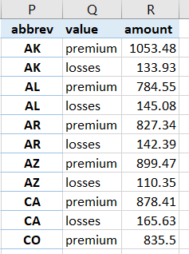

# _Advancing into Analytics_: Let's Practice! 


<p align="center">

</p>

This repo contains extra practice sets based on [_Advancing into Analytics: From Excel to Python and R_](http://stringfestanalytics.com/book/).

  
[Part II: From Excel to R](#part-ii)  


<h1 id="part-ii">
Part II: From Excel to R
</h1>


## 6. First Steps with R for Excel Users 

1. Run the following code. What happens?

  ```{r}
  temps <- c(66, 71, 68, 74, 70)
  days <- c('Mon', 'Tue', 'Wed', 'Thr', 'Fri')

  names(temps) <- days

  temps['Wed']
  ```

 - Knowing what you do now, return the values for Monday and Friday first by index position, then by name. 

2. Explore the R Help page in RStudio: from the menu click Help > R Help. 
3. [Create an RStudio Community account](https://community.rstudio.com). This is an excellent forum for getting help in R and RStudio moderated by the pros. 
4. If you would like additional reading on getting started in R, check out the following:

- [A Tour of RStudio](http://stringfestanalytics.com/tourofrstudio/)
- [Five Things Excel Users Should Know about R](https://github.com/stringfestdata/advancing-into-analytics-practice/blob/main/resources/five-things-excel-users-should-know-about-r.pdf)
- [What is an open source software distribution?](https://stringfestanalytics.com/what-is-open-source-distribution/) 

## 7. Data Structures in R 

1. *Easter egg time!* In this chapter we used the `write_xlsx()` function from package `writexl`. Pull its help documentation... an anthropomorphized office supply awaits!
2. Many packages include *vignettes*, similar to white papers showing important features and concepts of the package. These can be viewed via the `browseVignettes()` function. 
  - Open the vignettes for `dpyr` and `tidyverse`. The vignettes will open in a separate internet tab. Use the function's help documentation to confirm what to do here. 
3. How many datasets does the `babynames` package come with? Choose one, run its descriptive statistics and write the dataset to an Excel worksheet. 

## 8. Data Manipulation and Visualization in R   


Using the `car-crashes` dataset:

1. The `total` variable represents the number of drivers involved in fatal collisions per billion miles. Derive a column that represents the number of such drivers per million miles. 
2. Find the average insurance premium for each Census region. 
3. Visualize the distribution of `no_previous`. Which distribution does it appear to follow? 
4. Visualize the relationship between `ins_premium` and `ins_losses`. Re-label your axes and add a chart title. Does the relationship appear to be linear? 
5. Create a data frame in R that would look like this in Excel: 





## 9. Capstone: R for Data Analytics 

Using the `birthweights` dataset: 

1.	Is there a significant difference in the gestation period of babies whose mother is and is not a smoker?
2.	Produce a correlation matrix of the relevant variables in this dataset.
3.	Visualize the relationship of weight by length.
4.	Regress weight on height. Find the equation of the fit regression line. Is there a significant relationship? What percentage of the variance in weight is explained by height?
5.	Split your regression model into training and testing subsets. What is the R-squared and RMSE on your test model?


**Extra credit**: Conduct your work in an [R Notebook](https://bookdown.org/yihui/rmarkdown/notebook.html?_ga=2.192006506.1923766174.1629579433-21366166.1628973922) (included with RStudio) or Jupyter Notebook (see [instructions here](https://irkernel.github.io/installation/) for using R with Jupyter). 

<h1 id="part-iii">
Part III: From Excel to Python
</h1>
